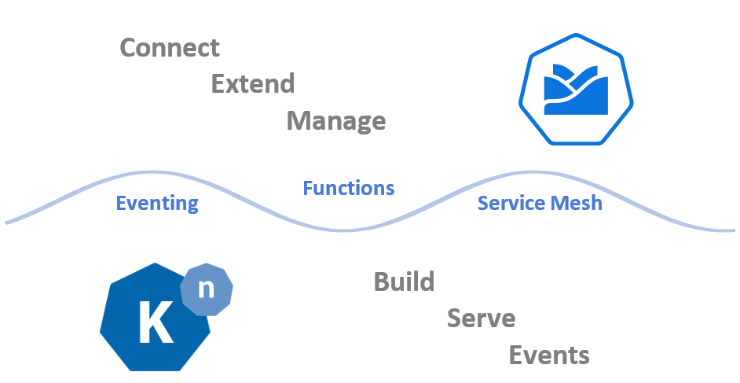

When Kyma was introduced to the public few weeks ago at [Google Cloud Next ’18](https://cloud.withgoogle.com/next18/sf/) – we talked about the strong partnership we have with the Knative community. Kyma and Knative provide two complementary sets of building blocks, which together offer a powerful framework and a toolset to build cloud-native solutions on top of Kubernetes.

If you look at the Kyma source code right now, you might wonder why you are not finding many references to Knative. The answer is quite simple - in the last 1.5 months the whole Kyma team was working on restructuring the repositories, making them ready for going open source and remove all internal references and tool dependencies. We’ve done all of that from a stable branch.  

In parallel to those major changes - we have a fork with Kyma and Knative integrated. It was used to build some first proof-of-concept cloud-native solutions using Knative and Kyma deployed together. It’s also the basis for our stage demo during [the project launch](https://www.youtube.com/watch?v=NaaGPGKyXEc&amp;feature=youtu.be&amp;t=42m50s). On the other hand,this was our first approach to combine the projects. As both are really young and going through a number of changes – looking back some of our design decisions have not been optimal. 
 
The plan we’re executing throughout the next couple of weeks is to refactor the current Kyma codebase and modularize it. Several functional components can then be installed optionally, which will certainly improve the experience when developing locally using for example [Minikube](https://kubernetes.io/docs/tasks/tools/install-minikube/). 
 
For all shared technologies such as [Istio](https://istio.io/) - we are going to provide the proper configurable options, so that Istio deployed with Knative will also support all Kyma requirements. 
 
And finally, we are going to extract some components. For example, we extract the Kyma eventing and fully integrate with the Knative eventing. We’ll evaluate the possibility of contributing the Kyma eventing based on [NATS.io](https://nats.io/) streaming as a Knative compatible eventing implementation to the Knative project. Users of Knative and Kyma will than have the additional option to decide which eventing implementation to use (e.g. as an alternative to the Knative provided Kafka based implementation). 
 
Stay tuned for more updates! Moreover - your ideas and proposals are highly welcome. Don’t be shy!  